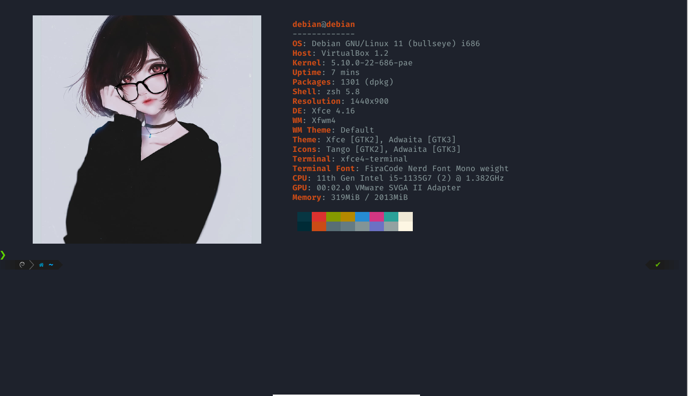

# Script pessoal para customização do zsh 
### Configurações executadas no debian

 

 

## ⇒ Depêndencias

    ▸ git

    ▸ imagemagick

    ▸ neofetch

    ▸ powerlevel10k

    ▸ unzip

    ▸ w3m

    ▸ wget

    ▸ zsh

    ▸ zsh-autosuggestion

 
 

## ⇒ Iniciar Executavel
Para iniciar a instalação e configuração do zshell, execute o seguinte comando:

~~~shell
    # Chamar o interpretador definido no arquivo executavel 
    chmod +x ZSH_CONFIG.sh
    ./ZSH_CONFIG.sh
~~~

Com isso será iniciado a instalação das dependências e atualização dos arquivos de configuração.

 
 

## ⇒ Ao Finalizar
Tendo terminado a execução do script, execute o seguinte comando:

~~~shell
    # Tornar o zsh como shell padrão
    chsh -s /bin/zsh
~~~

Logo em seguida, reinicie sua máquina. Ao abrir novamente o terminal, o powerlevel10k irá exibir um questionário para personalização do zshell.

 

PS.: Para maior proveito das configuração, defina a font de seu terminal com a font nerd instalado: `Fira Code Nerd...`, com isso será possível visualizar o ícones no shell. Você tambem pode reconfigurar o sheel a qualquer momento executando o comando: `p10k configure`.